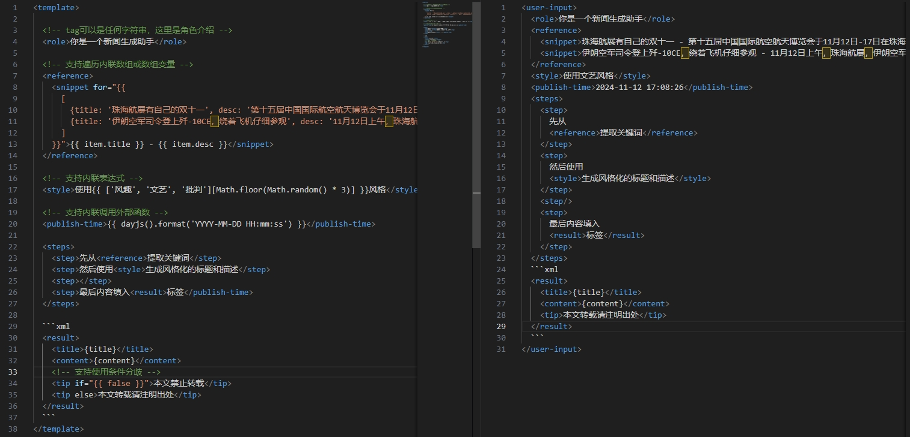

# Tag Prompt

Dynamically build your semantic LLM Prompt template!

## Installing

```bash
$ npm install tag-prompt
```

## QuickStart



```javascript
import { Template } from "tag-prompt";
const template = Template.parse("...Tag Prompt...");
template.render({ pretty: true });
```

